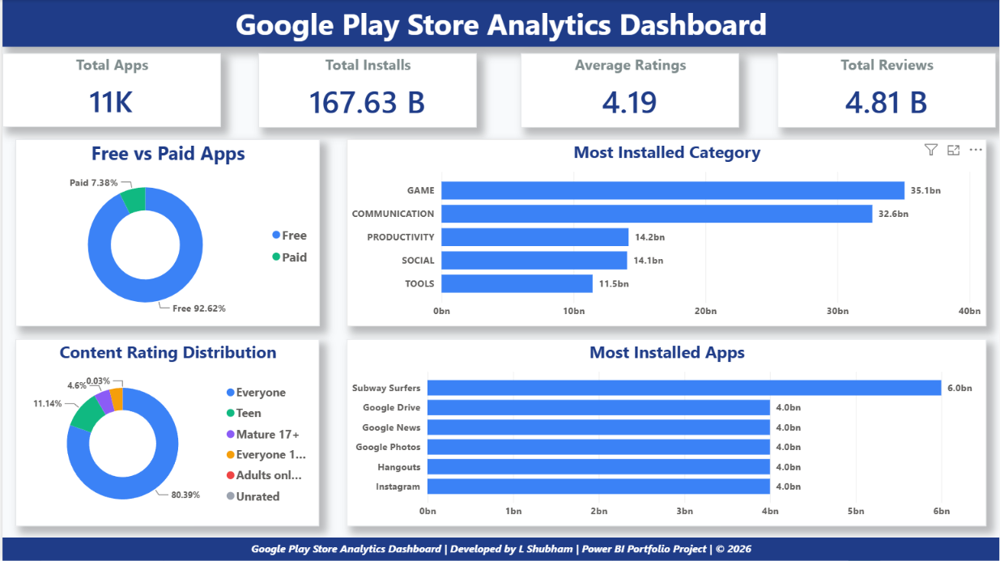
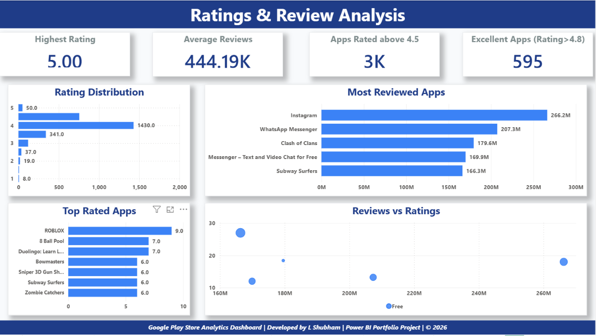
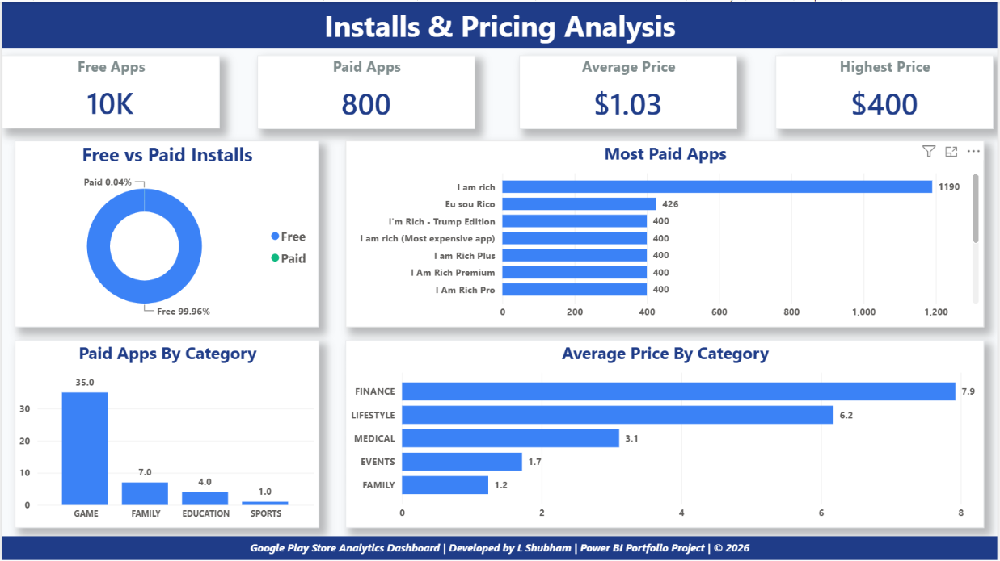
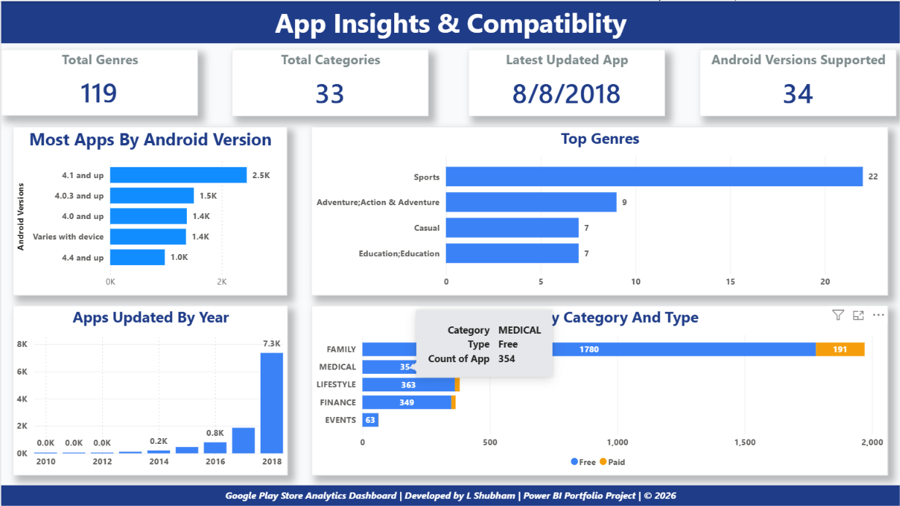
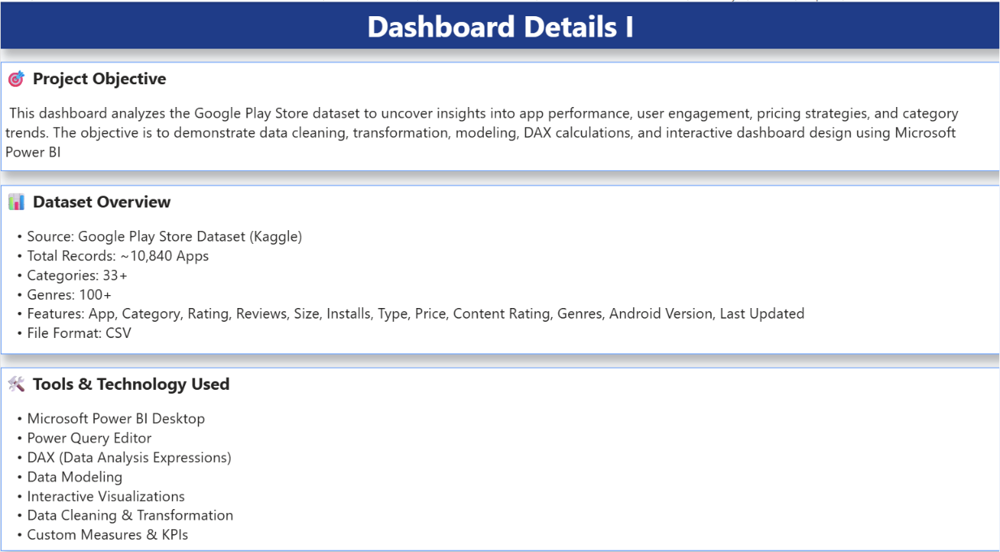
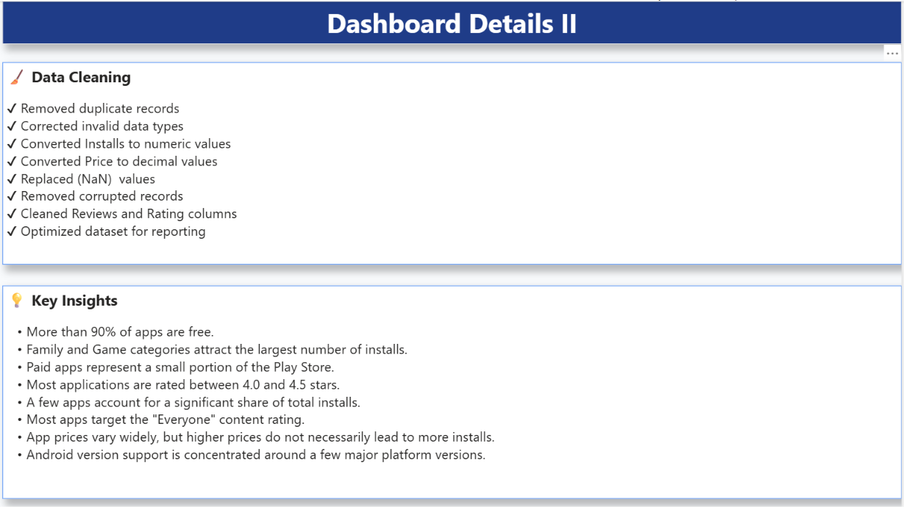

# 📱 Google Play Store Analytics Dashboard


---

# 📌 Project Overview

This project presents an interactive **Power BI Dashboard** built using the Google Play Store dataset.

The dashboard provides valuable insights into app performance, user engagement, pricing strategies, installs, ratings, categories, and Android version compatibility.

This project demonstrates the complete Data Analytics workflow:

- Data Cleaning
- Data Transformation
- Data Modeling
- DAX Calculations
- Interactive Dashboard Design
- Business Insights

---

# 🎯 Project Objectives

- Analyze Google Play Store applications
- Understand user ratings and reviews
- Compare Free vs Paid applications
- Analyze installs and pricing
- Study category-wise performance
- Build an interactive dashboard for business decision-making

---

# 🛠 Tools & Technologies

| Tool | Purpose |
|------|---------|
| Power BI Desktop | Dashboard Development |
| Power Query | Data Cleaning |
| DAX | Measures & KPIs |
| CSV Dataset | Data Source |
| GitHub | Project Hosting |

---

# 📂 Dataset Information

Dataset: Google Play Store Dataset

Features include:

- App
- Category
- Rating
- Reviews
- Size
- Installs
- Type
- Price
- Content Rating
- Genres
- Last Updated
- Android Version

---

# 📊 Dashboard Pages

## Page 1 – Executive Overview



---

## Page 2 – Ratings & Reviews Analysis



---

## Page 3 – Installs & Pricing Analysis



---

## Page 4 – Category & Platform Insights



---

## Page 5 – About This Dashboard



---

## Page 6 – Conclusion & Business Insights



---

# 📈 Key Business Insights

- The majority of Google Play Store apps are free.
- Family and Game categories contribute the highest number of installs.
- Higher app prices do not necessarily result in higher installs.
- Ratings are concentrated between 4.0 and 4.5.
- Most apps target the "Everyone" content rating.
- Only a small percentage of apps are paid.
- A small number of apps account for a significant share of total installs.
- Android version support is concentrated around a few major versions.

---

# 🧹 Data Cleaning

The dataset was cleaned using Power Query by:

- Removing duplicates
- Handling missing values
- Replacing NaN values
- Converting data types
- Cleaning Price column
- Cleaning Installs column
- Removing corrupted records
- Creating calculated measures

---

# ✨ Dashboard Features

- Interactive slicers
- KPI Cards
- Donut Charts
- Bar Charts
- Column Charts
- Stacked Charts
- Navigation Buttons
- Professional Theme
- Business Storytelling

---

# 📁 Project Structure

```
Google-Play-Store-Analytics-PowerBI

│
├── Dashboard
│   └── Google Play Store Analytics.pbix
│
├── Dataset
│   └── googleplaystore.csv
│
├── Images
│   ├── Dashboard_Page1.png
│   ├── Dashboard_Page2.png
│   ├── Dashboard_Page3.png
│   ├── Dashboard_Page4.png
│   ├── Dashboard_Page5.png
│   └── Dashboard_Page6.png
│
└── README.md
```

---

# 🚀 How to Use

1. Download the repository.
2. Open the `.pbix` file in Microsoft Power BI Desktop.
3. Refresh the dataset if required.
4. Explore the interactive dashboard.

---

# 👨‍💻 Author

## L Shubham

🔗 LinkedIn: https://www.linkedin.com/in/shubham-lingam

📧 Email: shubham.lingamm@gmail.com

Skills

- Power BI
- SQL
- Excel
- Python
- DAX
- Power Query

---

If you found this project helpful, consider giving it a ⭐ on GitHub.
